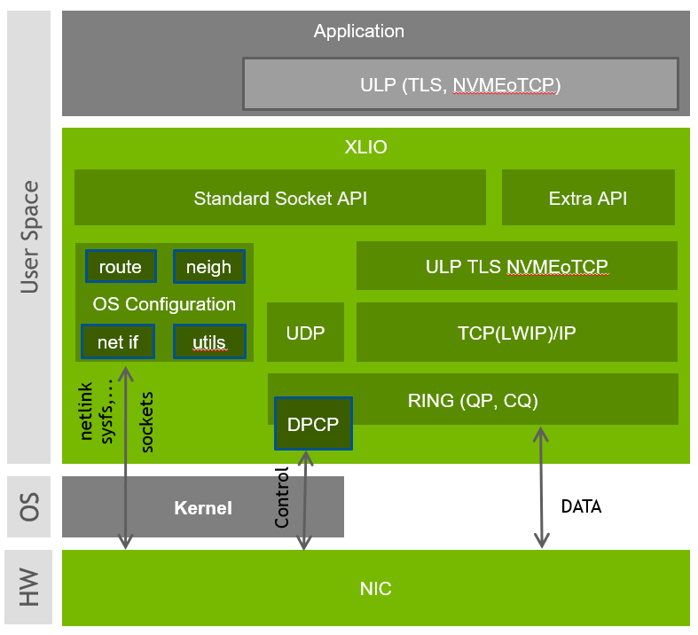

# XLIO - Accelerated IO SW library

The NVIDIA® Accelerated IO (XLIO) SW library boosts the performance of TCP/IP network applications providing high bandwidth and low CPU usage.
XLIO is a user-space software library which exposes standard POSIX and XLIO Ultra socket APIs with kernel-bypass architecture, enabling a hardware-based direct copy between an application user-space memory and the network interface.

Coupling XLIO with Crypto Enabled NVIDIA ConnectX, NVIDIA BlueField data processing unit (DPU) acceleration capabilities, provides a breakthrough performance of Transport Layer Security (TLS) encryption and decryption.
XLIO is capable of utilizing HW features such as LRO/TSO and Striding-RQ which increase TCP performance, without application code changes for both
POSIX socket and XLIO Ultra APIs.

Please visit our [documentation website](https://docs.nvidia.com/networking/category/xlio) for more details.

<hr>

* [Getting Started](#getting-started)
* [Architecture](#architecture)
* [Supported Transports](#supported-transports)
* [Supported CPU Architectures](#supported-cpu-architectures)
* [Supported NICs](#supported-nics)
* [Licenses](#licenses)
* [Information](#information)
* [Contribution](#contribution)

<hr>

## Getting Started

### Installing XLIO

XLIO is available as part of DOCA Software Stack.
Please visit [DOCA website](https://developer.nvidia.com/networking/doca) for more details.

### Building XLIO

#### Prerequisits

##### DOCA Software stack

XLIO requires NVIDIA DOCA-Host software stack or NVIDIA Bluefiled bundle to be installed on the system.
Please visit [DOCA website](https://developer.nvidia.com/networking/doca) for more details.

##### DPCP

DPCP (Direct Packet Control Plane) is mandatory to run XLIO.

XLIO utilises libdpcp as a git submodule, by that specifying a built-in DPCP version.
The built-in DPCP is configured and built with CMake as part of the XLIO build.

Note that if git is installed, and the root directory looks like a git directory, running ./autogen.sh runs
'git submodule update --init --recursive', so there is no need to run it explicitly.
Otherwise, you need to run that git command after cloning, or use 'git clone --recurse-submodules' when cloning.

By default libdpcp is linked statically into libxlio, this can be changed to dynamic linkage by running the 
libxlio `./configure` script with the `--enable-dpcp-shared` flag.

To link against an external DPCP version, run libxlio's `./configure` with the `--with-dpcp=/path/to/dpcp/install`
flag. In this case, libdpcp is not built as part of the XLIO build.
Alternatively, if some non-standard flags are needed for the DPCP build, run libxlio's `./configure` with the
`--with-dpcp-flags='-DOPTION=VALUE ...'` flag. It allows passing additional options to the built-in libdpcp CMake 
configuration. This option cannot be combined with `--with-dpcp`.

After pulling libxlio, which might trigger an update of the libdpcp submodule, it is advised to clean libdpcp
to protect against the unlikely case that old libdpcp artifacts remain and interfere with the build.

##### Tools

Autoconf, Automake, libtool, cmake, unzip, patch, libnl-devel (netlink 3)

#### Compiling XLIO

Building XLIO is done like this:

```sh
./autogen.sh
./configure --prefix=/where/to/install
make -j
make install
```
Commonly used flags for `./configure`:

- `--disable-utls` : Disables uTLS HW offload for supported NVIDIA HW.
- `--enable-static --disable-shared` : Build XLIO as a static library and not as a shared object.

Summary of `./configure` flags related to dpcp:
- `--with-dpcp=/where/dpcp/is/installed` : Use libdpcp from a pre-installed location. When this flag
   is used, libdpcp is not built. It is assumed that it is already built and installed at the specified directory.
- `--with-dpcp-flags='-DOPTION=VALUE ...'` : Pass additional options to the built-in libdpcp CMake configuration.
   This option cannot be combined with `--with-dpcp`.
- `--enable-dpcp-shared` : Link with dpcp dynamically instead of statically

#### Configure
See more [Options](./docs/configuration.md)

For the complete runtime parameter reference, see the [Configuration Reference](./docs/xlio_config_reference.md).

### Usage Examples

#### Sockperf

LD_PRELOAD=libxlio.so sockperf \<params\>

Reposiroty: [Sockperf](https://github.com/Mellanox/sockperf)

#### nginx

LD_PRELOAD=libxlio.so XLIO_NGINX_WORKERS_NUM=\<N\> nginx \<nginx_params\>

N - Number of Nginx workers.

## Architecture



## Supported Transports

* IPv4/6
* TCP
* UDP

## Supported CPU Architecturess

* [x86_64](https://en.wikipedia.org/wiki/X86-64)
* [Arm](https://www.arm.com/)

## Supported HW

* Please refer to the [User Manual](https://docs.nvidia.com/networking/software/accelerator-software/index.html#xlio) for supported device list.

## Licenses
See [LICENSE](./LICENSE) file

## Information
See [README](./README) file for XLIO features and parameters.

## Contribution
[Contribution](./docs/contributing.md) guidelines for this project
